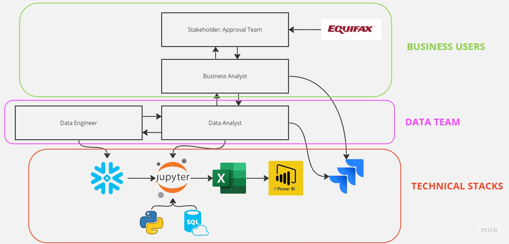

# PROJECT INTRODUCTION

## COMPANY BACKGROUND

The client company is an online retailer in Australia, specializing in consumer electronics. We strive to provide exceptional customer service and solutions, offering a wide selection of branded technology and appliances.

## BUSINESS PROCESS INTRODUCTION

### Business Process:

As a data analyst in the data team, your role will involve collaborating with data engineers to develop and maintain the Snowflake cloud data warehouse. You will utilize various data analytics tools such as Jupyter Notebook, VS Code, Snowflake, Excel, Power BI, and Jira to assist business users in uncovering valuable insights from extensive datasets.

It's important to note that all data requests will be submitted to the business analyst for review. The business analyst will act as the intermediary between the technical team and the business users. They will assign tasks to you and assist in managing the backlog of data-related jobs.

### Business Users:

- The Approval Team is responsible for reviewing all orders in which customers intend to purchase digital products using different payment methods, namely: 1) Upfront Payment, 2) Interest-Free Payment, and 3) Buy Now, Pay Later. Their primary objective is to minimize the risk of bad debt and losses by identifying and blocking potentially problematic customers.
- Business Analysts: Playing a crucial role in managing and grooming backlogs. They closely collaborate with business users to understand and analyze their specific business requirements. Additionally, they work closely with the technical team to effectively communicate these requirements and ensure they are properly understood and implemented. The Business Analyst acts as a bridge between the business users and the technical team, facilitating clear and efficient communication and alignment between the two groups.

### Data Team:

- Data Analyst:
    
    As a Data Analyst, your primary responsibility is to leverage various tools and techniques to analyze large-scale datasets. You will apply your domain knowledge and expertise to extract meaningful insights from the data. These insights will be used to guide and drive business users towards achieving higher business objectives.
    
    Your role involves working with tools such as Jupyter Notebook, VS Code, Snowflake, Excel, Power BI, and Jira to perform data analysis tasks. By combining your technical skills and domain expertise, you will be able to provide data-driven insights and recommendations to the business users. These insights can help inform strategic decision-making, optimize processes, identify opportunities for growth, and address business challenges.
    
    By harnessing the power of data, you will contribute to enhancing business performance and achieving higher business objectives.
    
- Data Engineers:
    
    Data Engineers are responsible for developing and maintaining the Snowflake data warehouse. They design and optimize the database schema, tables, and views to ensure efficient data storage and retrieval. They handle tasks such as setting up Snowflake accounts, configuring security, and managing data access permissions.
    
    Additionally, Data Engineers are responsible for building and maintaining the ETL pipelines. These pipelines involve extracting data from various sources, transforming and cleansing the data, and loading it into Snowflake. The Data Engineers ensure that the pipelines are robust, scalable, and efficient, allowing for the preparation of composite or materialized tables and views.
    
    Data Analysts rely on the work done by Data Engineers, as they use these prepared tables and views to perform their data analysis tasks. Data Analysts utilize tools like Jupyter Notebook, VS Code, Excel, Power BI, etc., to analyze the data and derive insights.
    

### Tech Stack:

- Snowflake: Snowflake is a cloud-based data warehouse platform that runs on popular cloud infrastructures like Amazon Web Services (AWS) or Microsoft Azure. It provides scalable and flexible storage and analytics capabilities, eliminating the need for managing infrastructure and enabling efficient data processing.
- Jupyter Notebook: Jupyter Notebook is an open-source web application that allows users to create and share documents containing live code, equations, visualizations, and narrative text. It supports multiple programming languages and is widely used for interactive data analysis, exploration, and documentation.
- VS Code: Visual Studio Code, commonly referred to as VS Code, is a lightweight source-code editor developed by Microsoft. It provides a rich set of features such as debugging, syntax highlighting, intelligent code completion, and Git integration. It is widely adopted by developers for various programming languages and frameworks.
- Excel: Microsoft Excel is a popular spreadsheet software used for organizing, analyzing, and visualizing data. It offers powerful calculation capabilities, graphing tools, pivot tables, and support for creating complex formulas. Excel is commonly used for data manipulation and reporting tasks.
- Power BI: Microsoft Power BI is a business intelligence tool that enables users to visualize and analyze data through interactive dashboards, reports, and data visualizations. It provides capabilities for data modeling, data preparation, and sharing insights across organizations.
- Jira: Jira is a project management and issue-tracking tool developed by Atlassian. It is widely used for agile project management, bug tracking, and task management. Jira provides features for organizing and tracking work, managing workflows, and facilitating collaboration among team members.

## TECH STACK DOWNLOADING LINKS

- Snowflake: Configure later when the data is ready
- Jupyter Notebook: [https://www.anaconda.com/](https://www.anaconda.com/)
- VS Code: [https://code.visualstudio.com/](https://code.visualstudio.com/)
- Power BI: [https://powerbi.microsoft.com/en-us/downloads/](https://powerbi.microsoft.com/en-us/downloads/)
- Jira: Configure later when the students are ready
- Git: Configure later
- Slack: Configure later
