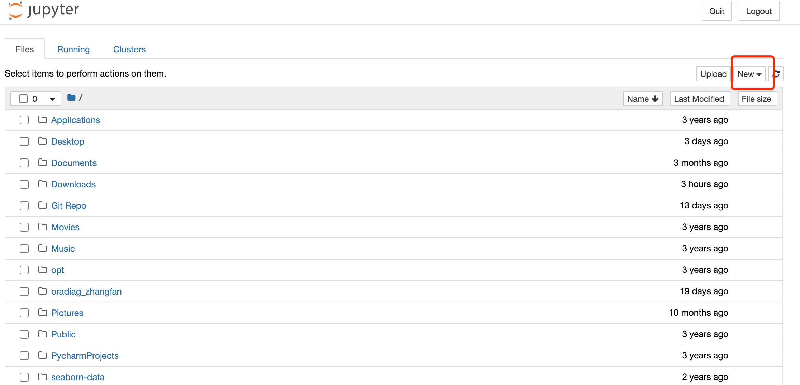

# Snowflake-Config-File

## PURPOSE

Apply the config file to run Snowflake and Snowpark in Jupyter Notebook

## PROCEDURES

### STEP ONE

- Instal ANACONDA and initialise Jupyter Notebook
- Click “NEW” button at the right up corner to create a folder named “CONFIG_FILES”




- Start a new notebook under this folder


- Type Code below

```python
# Install the Snowpark Python package into the Python 3.8 virtual environment
pip install snowflake-snowpark-python
# Specify Pandas packages that you want to install in the environment:
pip install "snowflake-snowpark-python[pandas]"

# Test above procedures - No errors returned means env installed successfully
from snowflake.snowpark.functions import avg
import pandas as pd

# To use Snowpark in your application, you need to create a session
from snowflake.snowpark import Session

# Establish a session with a Snowflake database using the same parameters 
# (for example, the account name, user name, etc.) that you use in the connect function in the Snowflake Connector for Python
>>> connection_parameters = {
...    "account": "<your snowflake account>",
...    "user": "<your snowflake user>",
...    "password": "<your snowflake password>",
...    "role": "<your snowflake role>",  # optional
...    "warehouse": "<your snowflake warehouse>",  # optional
...    "database": "<your snowflake database>",  # optional
...    "schema": "<your snowflake schema>",  # optional
...  }  

>>> new_session = Session.builder.configs(connection_parameters).create()

# TEST ABOVE PRECEDURE

test_df = session.table('DB_NAME.SCHEMA_NAME.TABLE_NAME')\
		 .select('*')

test_df.show() # if test_df can show the final result, the snowpark env has been installed successfully
```
