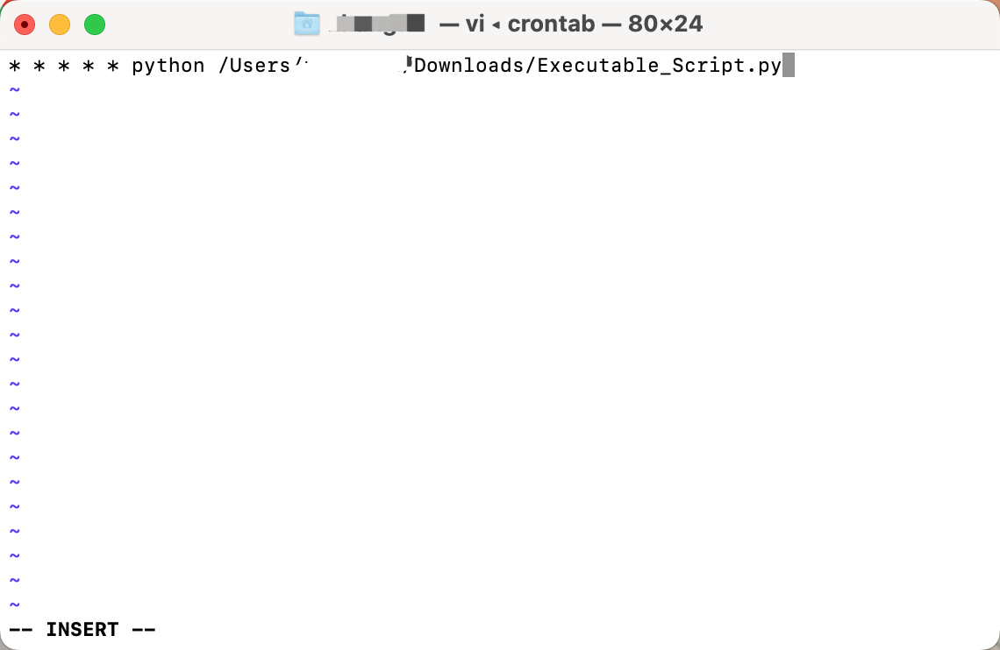

# Automation Workflow

## Tool Introduction

- Terminal:
    - The Mac Terminal is a command-line interface (CLI) application on macOS that allows users to interact with the operating system through text commands. It provides a way to execute commands, run scripts, navigate directories, manage files, and perform various system tasks using the command line.
- Crontab:
    - Crontab (cron table) is a time-based job scheduler in Unix-like operating systems, including macOS. It allows users to schedule recurring tasks or commands to run automatically at specific intervals, such as every minute, hourly, daily, weekly, or monthly.
    - The crontab command is used to create, view, edit, and manage the cron jobs. Each user on a Unix-like system can have their own crontab file that contains the scheduled jobs specific to that user.
- Crontab Viewer: [https://crontab.guru/](https://crontab.guru/)

## Process

Step One: 

- Open the Terminal


Step Two: 

- Type **`crontab -e`** and press Enter. This will open the crontab file in the default editor.

Step Three: 

- Add a new line to the file with the following format:

```python
* * * * python /path/to/your/script.py
```



Step Four:

- Save the file and exit the editor.

Step Five:

- The script will now run automatically based on the schedule you set in the crontab file. The **`* * * * *`** represents the schedule in the format of minute, hour, day of the month, month, and day of the week, respectively. You can modify this schedule as per your requirements.
